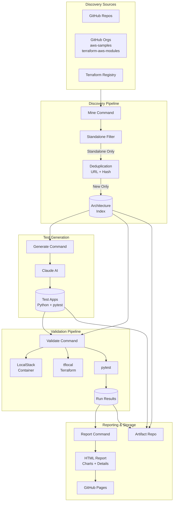
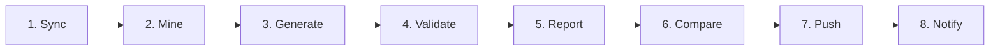

# LocalStack Quality Monitor (LSQM)

[](https://github.com/lazarkanelov/localstack-quality-monitor/actions/workflows/weekly-run.yml)

An automated system for discovering, validating, and monitoring AWS Terraform architectures against [LocalStack](https://localstack.cloud). It continuously discovers real-world Terraform configurations, generates test applications, and validates them to measure LocalStack's compatibility with AWS services.

**[View Latest Report](https://lazarkanelov.github.io/localstack-quality-monitor/latest/)** | **[All Reports](https://lazarkanelov.github.io/localstack-quality-monitor/)**

## Features

- **Automated Discovery** - Finds standalone Terraform architectures from GitHub repos, organizations, and Terraform Registry
- **Smart Filtering** - Identifies self-contained, deployable architectures (no external dependencies)
- **Test Generation** - Uses Claude AI to generate Python test applications for each architecture
- **LocalStack Validation** - Deploys architectures to LocalStack and runs generated tests
- **Trend Analysis** - Tracks pass/fail rates over time, detects regressions
- **Interactive Reports** - Dark-themed dashboard with charts, filtering, and detailed failure analysis
- **CI/CD Ready** - GitHub Actions workflow for weekly automated runs

## Architecture



## How It Works

### Pipeline Overview

Each run executes these stages in sequence:

| Stage | What Happens |
|-------|--------------|
| **Sync** | Pulls latest index from artifact repo |
| **Mine** | Discovers NEW architectures only (deduped by URL + hash) |
| **Generate** | Generates test apps for architectures missing them |
| **Validate** | Runs ALL architectures (new + existing) against LocalStack |
| **Report** | Generates HTML report with charts and details |
| **Push** | Saves everything back to artifact repo |

**Each run:**
- ✅ Discovers only **new** architectures (won't re-add existing ones)
- ✅ Re-validates **all** architectures (tracks results over time)
- ✅ Builds run history for trend analysis

**This design enables:**
1. **Trend Tracking** - Monitor pass/fail rates across LocalStack versions
2. **Regression Detection** - Identify architectures that used to pass but now fail
3. **Continuous Expansion** - Automatically grow the test suite with new discoveries

---

### 1. Discovery

The system discovers Terraform architectures from multiple sources:

| Source | Description |
|--------|-------------|
| **GitHub Repos** | Direct scanning of specific repositories with glob patterns |
| **GitHub Orgs** | Organization-wide search (aws-samples, terraform-aws-modules) |
| **Terraform Registry** | Popular AWS modules with 1000+ downloads |

**Standalone Filtering**: Only architectures that are self-contained get indexed:
- Has at least one `resource "aws_*"` block
- All variables have default values
- No remote module dependencies
- No remote state dependencies
- Uses only LocalStack Community services

**Deduplication**: Architectures are tracked by source URL and content hash to avoid duplicates.

### 2. Test Generation

For each architecture, Claude AI generates:
- Python test application using pytest
- Tests that validate the deployed infrastructure
- Assertions for AWS service functionality

### 3. Validation

Each architecture is validated against LocalStack:

1. Start LocalStack container
2. Run `tflocal init && tflocal apply`
3. Execute generated pytest tests
4. Capture logs, errors, and test results
5. Analyze failures for LocalStack-specific issues

### 4. Reporting

Interactive HTML reports include:
- Pass rate trends over time
- Status distribution charts
- Searchable/filterable architecture table
- Detailed drawer with:
  - Terraform files with syntax highlighting
  - Python test code
  - Full LocalStack logs
  - Failure analysis
  - Steps to reproduce

## Installation

### Prerequisites

- Python 3.11+
- Docker (for LocalStack)
- Terraform 1.6+
- GitHub token with repo access

### Install from Source

```bash
git clone https://github.com/lazarkanelov/localstack-quality-monitor.git
cd localstack-quality-monitor
pip install -e .
```

### Verify Installation

```bash
lsqm --version
lsqm --help
```

## Configuration

### Environment Variables

```bash
export GITHUB_TOKEN="ghp_..."           # GitHub API access
export ANTHROPIC_API_KEY="sk-ant-..."   # Claude AI for test generation
export ARTIFACT_REPO="owner/repo"       # Repository for storing artifacts
```

### Configuration Files

**`config.yaml`** - Main configuration:
```yaml
anthropic_api_key: ""
github_token: ""
artifact_repo: "your-org/lsqm-artifacts"
token_budget: 500000
localstack_version: "latest"
parallel: 4
timeout: 300
```

**`sources.yaml`** - Discovery sources:
```yaml
github_repos:
  enabled: true
  repositories:
    - url: aws-samples/serverless-patterns
      paths:
        - "*-terraform"

github_orgs:
  enabled: true
  organizations:
    - aws-samples
    - terraform-aws-modules

terraform_registry:
  enabled: true
  providers: [aws]
  limit_per_provider: 100
  min_downloads: 1000
```

## CLI Commands

### Core Commands

```bash
# Sync artifacts from remote repository
lsqm sync

# Discover new architectures
lsqm mine --limit 50

# Generate test applications
lsqm generate --budget 500000

# Validate against LocalStack
lsqm validate --parallel 4 --timeout 300

# Generate HTML report
lsqm report --run <run-id> --output ./report

# Push artifacts to repository
lsqm push --message "Weekly run"
```

### Utility Commands

```bash
# Compare runs and detect regressions
lsqm compare

# Show current status
lsqm status

# Clean up old artifacts
lsqm clean --keep 10

# Send notifications
lsqm notify
```

### Options

```bash
# Use custom config
lsqm --config ./my-config.yaml mine

# Verbose output
lsqm -v validate

# Dry run (no changes)
lsqm --dry-run mine --limit 10
```

## GitHub Actions Workflow

The project includes a fully automated CI/CD pipeline that runs weekly or on-demand.

### Trigger Configuration

```yaml
# .github/workflows/weekly-run.yml
on:
  schedule:
    - cron: '0 0 * * 0'  # Every Sunday at midnight UTC
  workflow_dispatch:      # Manual trigger with inputs
    inputs:
      localstack_version:
        description: 'LocalStack version to test'
        default: 'latest'
      discovery_limit:
        description: 'Max architectures to discover'
        default: '100'
      token_budget:
        description: 'Claude API token budget'
        default: '500000'
```

### Workflow Jobs

The workflow consists of 8 sequential jobs with artifact caching between them:



| Job | Duration | Description |
|-----|----------|-------------|
| **Sync Artifacts** | ~30s | Clones artifact repo, loads architecture index |
| **Discover Architectures** | ~1-5min | Scans sources for new Terraform configs |
| **Generate Test Apps** | ~5-30min | Uses Claude AI to create pytest tests |
| **Validate Against LocalStack** | ~10-60min | Deploys and tests each architecture |
| **Generate & Deploy Report** | ~1min | Creates HTML report, deploys to GitHub Pages |
| **Compare Results** | ~30s | Detects regressions from previous run |
| **Push to Artifact Repo** | ~1min | Commits new architectures and results |
| **Send Notifications** | ~10s | Slack alerts (if configured) |

### Artifact Caching Strategy

Each job saves its state to GitHub Actions cache, allowing the next job to continue:

```
lsqm-artifacts-{run_id}           # After sync
lsqm-artifacts-mined-{run_id}     # After mine
lsqm-artifacts-generated-{run_id} # After generate
lsqm-artifacts-validated-{run_id} # After validate
lsqm-artifacts-final-{run_id}     # After report
```

### Job Details

**1. Sync Artifacts**
```bash
lsqm sync
```
- Clones or pulls the artifact repository
- Loads existing architecture index for deduplication
- Caches artifacts for subsequent jobs

**2. Discover Architectures**
```bash
lsqm --config config.yaml mine --limit 100
```
- Reads `sources.yaml` for discovery configuration
- Scans GitHub repos, orgs, and Terraform Registry
- Filters for standalone architectures only
- Skips already-indexed architectures (deduplication)

**3. Generate Test Apps**
```bash
lsqm generate --budget 500000
```
- Identifies architectures without test applications
- Sends Terraform to Claude AI with generation prompt
- Validates generated Python syntax
- Saves test apps to `apps/{hash}/` directory

**4. Validate Against LocalStack**
```bash
lsqm validate --parallel 2 --timeout 300
```
- Spins up LocalStack Docker container
- For each architecture:
  - Runs `tflocal init && tflocal apply`
  - Executes pytest against deployed infrastructure
  - Captures logs, errors, test results
- Stores results in `runs/{run_id}/`

**5. Generate & Deploy Report**
```bash
lsqm report --run {run_id} --output ./report-output
```
- Generates interactive HTML report
- Deploys to GitHub Pages (`gh-pages` branch)
- Archives report by date for history

**6. Compare Results**
```bash
lsqm compare --output json
```
- Compares current run with previous run
- Identifies regressions (pass → fail)
- Identifies fixes (fail → pass)
- Outputs regression count for notifications

**7. Push to Artifact Repo**
```bash
lsqm push --message "Weekly run {date}"
```
- Commits new architectures to index
- Commits generated test apps
- Commits validation results
- Pushes to artifact repository

**8. Send Notifications**
```bash
lsqm notify
```
- Sends Slack notification (if webhook configured)
- Creates GitHub Actions summary with links

### Required Secrets

| Secret | Description |
|--------|-------------|
| `GITHUB_TOKEN` | Automatic, for API access |
| `ANTHROPIC_API_KEY` | Claude AI for test generation |
| `ARTIFACT_REPO_TOKEN` | (Optional) Token for artifact repo if different |

### Required Variables

| Variable | Description |
|----------|-------------|
| `ARTIFACT_REPO` | Repository for artifacts (e.g., `owner/lsqm-artifacts`) |
| `SLACK_WEBHOOK_URL` | (Optional) Slack notifications |

## Project Structure

```
localstack-quality-monitor/
├── src/lsqm/
│   ├── cli.py              # Main CLI entry point
│   ├── commands/           # CLI commands (mine, validate, report, etc.)
│   ├── models/             # Data models (Architecture, ValidationResult)
│   ├── services/           # Core services
│   │   ├── discovery/      # Architecture discovery from sources
│   │   ├── generator.py    # Claude AI test generation
│   │   ├── validator.py    # LocalStack validation
│   │   ├── reporter.py     # HTML report generation
│   │   └── comparator.py   # Regression detection
│   ├── templates/          # Jinja2 HTML templates
│   └── utils/              # Configuration, hashing, logging
├── tests/                  # pytest test suite
├── .github/workflows/      # CI/CD workflows
├── config.yaml             # Main configuration
├── sources.yaml            # Discovery sources
└── README.md
```

## Report Features

The generated HTML report includes:

### Dashboard
- Total architectures count
- Pass/fail/timeout/error breakdown
- Pass rate percentage
- Run duration

### Charts
- **Pass Rate Trend** - Line chart showing pass rate over time
- **Status Distribution** - Doughnut chart of current run

### Architecture Table
- Search by name
- Filter by status (Passed, Failed, Timeout, Error)
- Sort by status, name, or duration
- Click to open details drawer

### Architecture Details (Drawer)
- Status indicator
- AWS services used
- Tested use cases and AWS operations
- Failure analysis with error messages
- Test results summary
- Terraform files with syntax highlighting
- Python test code
- Full logs (LocalStack + Terraform)
- Steps to reproduce for failures
- Links to artifact repository

## Development

### Setup Development Environment

```bash
# Clone and install in dev mode
git clone https://github.com/lazarkanelov/localstack-quality-monitor.git
cd localstack-quality-monitor
python -m venv .venv
source .venv/bin/activate
pip install -e ".[dev]"
```

### Run Tests

```bash
# All tests
pytest

# With coverage
pytest --cov=src/lsqm

# Specific test file
pytest tests/test_services.py -v
```

### Linting

```bash
ruff check src/ tests/
ruff format src/ tests/
```

## Contributing

1. Fork the repository
2. Create a feature branch (`git checkout -b feature/amazing-feature`)
3. Make your changes
4. Run tests (`pytest`)
5. Run linter (`ruff check .`)
6. Commit your changes (`git commit -m 'Add amazing feature'`)
7. Push to the branch (`git push origin feature/amazing-feature`)
8. Open a Pull Request

